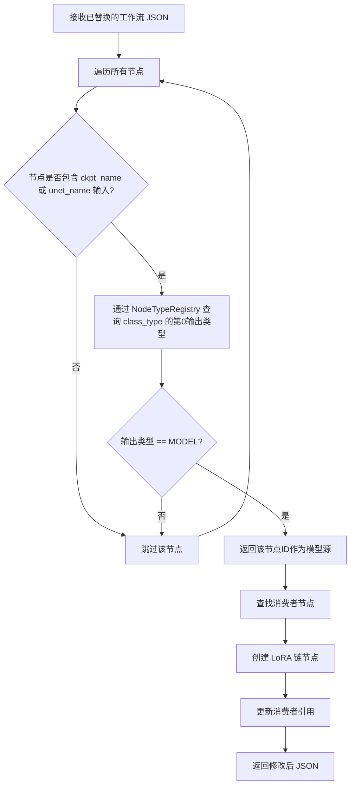

# LoRA Chain 注入判断逻辑改造计划（修订版）

## 问题描述

当前 [`LoraInjectionUtils.findModelSourceNode()`](app/src/main/java/sh/hnet/comfychair/util/LoraInjectionUtils.kt:140-156) 通过遍历节点并匹配硬编码的 `class_type` 列表（`CheckpointLoaderSimple`、`UNETLoader`）来寻找模型源节点。自定义节点如 `UNETLoaderGGUF` 因 `class_type` 不在此列表中而无法被识别。

## 方案：利用输入键匹配 + 输出类型验证

不再按 `class_type` 遍历节点，而是：

1. **通过输入键定位**：查找工作流 JSON 中拥有 `ckpt_name` 或 `unet_name` 输入键的节点——这些输入键正是界面 "Checkpoint" 和 "UNET" 选项所对应的字段
2. **通过 `NodeTypeRegistry` 验证**：检查该节点的输出类型是否为 `MODEL`
3. 若满足条件，则在其后注入 LoRA 链

### 核心变更

#### [`LoraInjectionUtils.findModelSourceNode()`](app/src/main/java/sh/hnet/comfychair/util/LoraInjectionUtils.kt:140-156)

**修改前**：遍历所有节点，按 `class_type` 匹配硬编码列表

```kotlin
private fun findModelSourceNode(nodes: JSONObject, workflowType: WorkflowType): String? {
    val loaderTypes = listOf("CheckpointLoaderSimple", "UNETLoader")
    for (targetClassType in loaderTypes) {
        val nodeIds = nodes.keys()
        while (nodeIds.hasNext()) {
            val nodeId = nodeIds.next()
            val node = nodes.optJSONObject(nodeId) ?: continue
            val classType = node.optString("class_type", "")
            if (classType == targetClassType) {
                return nodeId
            }
        }
    }
    return null
}
```

**修改后**：查找拥有 `ckpt_name` 或 `unet_name` 输入键的节点，并通过 `NodeTypeRegistry` 验证输出类型

```kotlin
private fun findModelSourceNode(
    nodes: JSONObject,
    workflowType: WorkflowType,
    nodeTypeRegistry: NodeTypeRegistry
): String? {
    // UI选项 "Checkpoint" 和 "UNET" 对应的输入键
    val modelSourceInputKeys = listOf("ckpt_name", "unet_name")
    
    val nodeIds = nodes.keys()
    while (nodeIds.hasNext()) {
        val nodeId = nodeIds.next()
        val node = nodes.optJSONObject(nodeId) ?: continue
        val inputs = node.optJSONObject("inputs") ?: continue
        
        // 检查该节点是否包含界面选项对应的输入键
        val hasModelInputKey = modelSourceInputKeys.any { inputs.has(it) }
        if (!hasModelInputKey) continue
        
        // 验证该节点的输出类型是否为 MODEL
        val classType = node.optString("class_type", "")
        val outputType = nodeTypeRegistry.getOutputType(classType, 0)
        if (outputType == "MODEL") {
            return nodeId
        }
    }
    return null
}
```

### 调用链变更

| 方法 | 变更 |
|---|---|
| [`LoraInjectionUtils.injectLoraChain()`](app/src/main/java/sh/hnet/comfychair/util/LoraInjectionUtils.kt:26-77) | 增加 `nodeTypeRegistry: NodeTypeRegistry` 参数并传递给 `findModelSourceNode` |
| [`WorkflowManager.injectLoraChain()`](app/src/main/java/sh/hnet/comfychair/WorkflowManager.kt:1486-1490) | 传递 `ConnectionManager.nodeTypeRegistry` |
| ViewModel 调用方（5 处） | 无需修改，因为都通过 `WorkflowManager.injectLoraChain()` 间接调用 |

### 边界情况处理

1. **`NodeTypeRegistry` 未填充**：`getOutputType()` 返回 `null`，跳过该节点；若所有节点均无匹配，`findModelSourceNode` 返回 `null`，LoRA 注入跳过（返回原始 JSON）
2. **多个节点拥有 `ckpt_name`/`unet_name` 输入**：返回第一个匹配的节点（与原逻辑一致）
3. **节点有 `ckpt_name` 但输出非 MODEL**（极罕见）：不会注入 LoRA 链

### 流程图



## 影响范围

| 文件 | 变更类型 |
|---|---|
| [`app/src/main/java/sh/hnet/comfychair/util/LoraInjectionUtils.kt`](app/src/main/java/sh/hnet/comfychair/util/LoraInjectionUtils.kt) | 修改核心逻辑 |
| [`app/src/main/java/sh/hnet/comfychair/WorkflowManager.kt`](app/src/main/java/sh/hnet/comfychair/WorkflowManager.kt) | 传递 NodeTypeRegistry |
| 所有 ViewModel 调用方 | 无需修改 |

## 验证方法

1. 使用标准 `CheckpointLoaderSimple` 工作流（含 `{{ckpt_name}}` 占位符）→ LoRA 链应正常注入
2. 使用 `UNETLoaderGGUF` 等自定义节点工作流（含 `{{unet_name}}` 占位符）→ LoRA 链应正常注入
3. 使用不含 `ckpt_name`/`unet_name` 输入的工作流 → LoRA 链不会被注入
4. 使用空 LoRA 链生成 → 正常工作流不受影响
